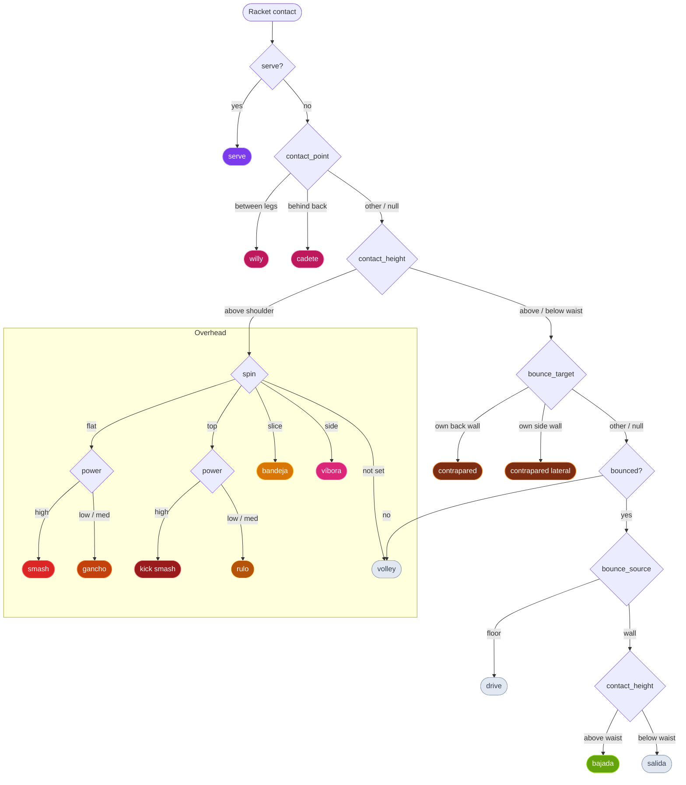
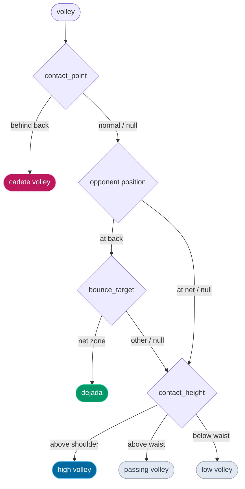
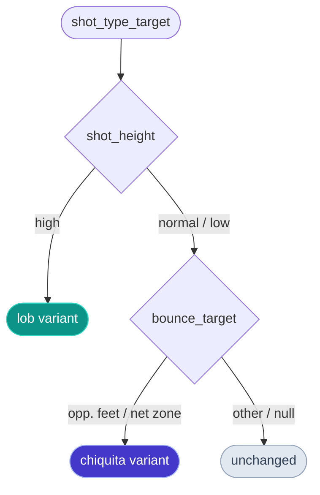

# Ball Labeller — Shot Type Labelling

**Goal:** Add shot characterisation to each racket-impact frame. Rather than asking the labeller to pick a shot name directly, they set a small set of observable primitive dimensions; the shot type is then **derived automatically** from those dimensions via logical rules. The primitives are stored alongside the derived type for richer ML use.

---

## Primitive Dimensions

These are the attributes a labeller can directly observe from the video at the moment of racket contact.

| Field | Type | Values | What to observe |
|---|---|---|---|
| `contact_height` | enum | `above_shoulder` / `above_waist` / `below_waist` | Height of the player's contact point. `above_shoulder` = overhead shot; `above_waist` vs `below_waist` discriminates bajada from salida on wall bounces |
| `bounced` | bool | `false` / `true` | Did the ball bounce (floor or wall) before contact? `false` = volley / serve |
| `bounce_source` | enum\|null | `floor` / `wall` / `null` | If `bounced=true`: did it come off the floor or a wall? `null` when `bounced=false` |
| `hand` | enum\|null | `forehand` / `backhand` / `null` | Which side of the body the player used at contact. `null` when not observable (e.g. occluded) |
| `power` | enum | `low` / `medium` / `high` | Perceived effort and resulting ball speed |
| `spin` | enum | `flat` / `top` / `slice` / `side` | Dominant spin: none, topspin, slice (backspin), or sidespin |
| `shot_height` | enum | `high` / `normal` / `low` | Height of the ball's trajectory after contact |
| `contact_point` | enum\|null | `normal` / `behind_back` / `between_legs` / `null` | How the racket is held at contact. `behind_back` = cadete (racket swung behind the body); `between_legs` = willy (racket passed between the legs). `null` / `normal` = standard grip |
| `opponent_position` | enum\|null | `at_net` / `at_back` / `null` | Where the opponents are positioned at the moment of contact. Used to discriminate dejada (drop shot when opponents are at the back). `null` when not clearly observable |
| `bounce_target` | enum\|null | `net_zone` / `service_line` / `back_zone` / `back_wall` / `opponents_feet` / `own_back_wall` / `own_side_wall` / `null` | Estimated landing zone of the ball if uninterrupted after contact. `net_zone` = between net and service line; `opponents_feet` = directly at the opponents' feet; `back_zone` = behind service line; `back_wall` = heading to the opponents' back glass; `own_back_wall` = heading to the player's own back glass (contrapared); `own_side_wall` = heading to the player's own side glass (contrapared lateral). `null` when trajectory is not estimable |

---

## Shot Type Derivation Rules

Derivation is a two-phase pipeline:

1. **Contact classification** — what did the player do? Uses `contact_height`, `bounced`, `bounce_source`, `spin`, `power`, and `bounce_target` (for own-glass shots). Produces a base shot type.
2. **Target classification** — where is the ball going? Uses `shot_height` and `bounce_target`. Upgrades four modifiable base shots (`passing_volley`, `low_volley`, `drive`, `salida`) to their lob or chiquita variant.

### Phase 1 — Contact classification

```
serve     ← explicit override only (see note below)

contact_height = above_shoulder:
  spin = flat  AND power = high              → smash
  spin = flat  AND power = low / medium      → gancho
  spin = top   AND power = high              → kick_smash
  spin = top   AND power = low / medium      → rulo
  spin = slice                               → bandeja
  spin = side                                → vibora
  spin = null  (no technique identified)     → high_volley

contact_point = between_legs             → willy               (final — takes priority over all)

contact_height = above_waist OR below_waist:
  bounce_target = own_back_wall              → contrapared        (final — not modified by phase 2)
  bounce_target = own_side_wall              → contrapared_lateral (final — not modified by phase 2)

  bounced = false:
    contact_point = behind_back            → cadete_volley  (final)
    opponent_position = at_back AND bounce_target = net_zone → dejada   (final)
    contact_height = above_waist             → passing_volley  *
    contact_height = below_waist             → low_volley     *

  bounced = true AND bounce_source = floor   → drive           *

  bounced = true AND bounce_source = wall:
    contact_height = above_waist             → bajada          (final)
    contact_height = below_waist             → salida          *
```

`*` = modifiable — passes through phase 2.

### Phase 2 — Target classification

Applies only to the four modifiable base shots. Priority is top-to-bottom.

```
shot_height = high                           → lob variant
bounce_target = opponents_feet OR net_zone   → chiquita variant
(else)                                       → unchanged
```

### Combination table

| base shot | + lob (shot\_height = high) | + chiquita (bounce\_target = opp. feet / net zone) |
|---|---|---|
| passing\_volley | **volley\_lob** | **volley\_chiquita** |
| low\_volley | **volley\_lob** | **volley\_chiquita** |
| drive | **lob** | **chiquita** |
| salida | **salida\_lob** | **salida\_chiquita** |

**Serve special case.** Padel serves are hit below waist height and are the first contact of the point. They don't fit neatly into the dimension grid (`contact_height=below_waist`, `bounced=false` → would derive as `low_volley`). `serve` is therefore an explicit one-button override; setting it bypasses the derivation entirely. Setting any other dimension while `serve` is active clears the serve override.

**`hand` is orthogonal** — it does not affect shot type derivation and is not shown in the table. Every row above can be labelled as `forehand`, `backhand`, or `null`.

**Unresolvable / ambiguous combinations** (e.g. `overhead=true` + `spin=flat` + no power set) should yield `null` (no derived type) so the labeller is forced to correct the dimensions rather than silently getting a wrong label.

---

## Derivation Flowcharts

### Phase 1 — Contact classification



Grey nodes pass through to a sub-diagram.

---

### Phase 1b — Volley classification



---

### Phase 2 — Target classification

Applies to `volley` (after phase 1b resolves to medium/low), `drive`, and `salida`.



| base shot | lob variant (shot\_height = high) | chiquita variant (bounce\_target = opp. feet / net zone) |
|---|---|---|
| passing\_volley | **volley\_lob** | **volley\_chiquita** |
| low\_volley | **volley\_lob** | **volley\_chiquita** |
| drive | **lob** | **chiquita** |
| salida | **salida\_lob** | **salida\_chiquita** |

---

## Implications Between Dimensions

Some dimension combinations are logically inconsistent or force other dimension values:

- `contact_height = above_shoulder` → overrides the bounced/wall logic entirely; all overhead shots are handled first.
- `contact_height = above_shoulder` + `shot_height = high` is unusual (smashing upward is rare); UI should allow it but not default to it.
- `contact_height = above_shoulder` + `spin = top`: both power levels resolve (`high` → kick smash, `low/med` → rulo); only unresolvable if power is not yet set.
- `contact_height = above_shoulder` + `spin = null`: resolves to `high_volley` — useful when the labeller can see the contact height but not the spin technique.
- `hand` is orthogonal to all derivation rules; it can be set independently and never causes an unresolvable combination.
- `bounced = false` → `bounce_source` must be `null`.
- `bounced = true` → `bounce_source` must be `floor` or `wall`.
- `bounce_source = wall` → `contact_height` must be `above_waist` or `below_waist` to resolve bajada vs salida variants; `above_shoulder` here would mean an overhead off the wall (unusual but valid — yields bandeja/vibora/smash based on spin).
- `bounce_source = floor` → `above_waist` vs `below_waist` does not affect derivation (both follow the lob/chiquita/drive rules).
- `power = high` + `shot_height = high` + `bounce_source = floor` → likely a smash mislabelled as lob; derivation yields `lob`, flag as suspicious.
- `spin = top` is only meaningful for `contact_height = above_shoulder`; topspin on a ground shot is very rare in padel.
- `bounce_target = opponents_feet` or `net_zone` is the discriminating condition for all chiquita variants (volley_chiquita, chiquita, salida_chiquita); without it set, the same trajectory defaults to medium/low volley, drive, or salida.
- `bounce_target = back_wall` implies `shot_height = high`; a low shot aimed at the back glass is physically inconsistent — the UI should warn.
- `bounce_target` is most useful when set; leaving it `null` is acceptable for shots where the trajectory is cut off by a player returning the ball.

The UI should highlight logically odd combinations with a subtle warning rather than blocking them.

---

## What Gets Stored

`LabelRecord` gains the primitive dimension fields plus the derived type:

```typescript
// New fields added to LabelRecord
contact_height: 'above_shoulder' | 'above_waist' | 'below_waist' | null
hand: 'forehand' | 'backhand' | null
bounced: boolean | null
bounce_source: 'floor' | 'wall' | null
power: 'low' | 'medium' | 'high' | null
spin: 'flat' | 'top' | 'slice' | 'side' | null
shot_height: 'high' | 'normal' | 'low' | null
bounce_target: 'net_zone' | 'service_line' | 'back_zone' | 'back_wall' | 'opponents_feet' | null
is_serve: boolean               // explicit serve override
shot_type: ShotType | null      // derived; recomputed on every dimension change
```

`shot_type` is stored for convenience (readable export, fast queries) but can always be recomputed from the primitives. Parsers should recompute it on load to keep it consistent.

---

## Schema Version Bump: v1 → v2

| Version | `impact` | `shot_type` + dimensions |
|---|---|---|
| v0 | absent | absent |
| v1 | present | absent |
| v2 | present | present |

CSV gains columns: `contact_height,hand,bounced,bounce_source,power,spin,shot_height,bounce_target,is_serve,shot_type`  
JSON label objects gain the same fields.  
Auto-detection: presence of `shot_type` column/key → v2.

---

## UI Design

### Expanded racket sub-panel (inside `ImpactSelector`)

When `impact = 'racket'` is selected the sub-panel expands. It is organised into two visual areas:

**1. Dimension toggles** (what the labeller sets)

Each dimension is a small labelled row of toggle buttons:

```
Contact      [ Above shoulder ]  [ Above waist ]  [ Below waist ]
Hand         [ Forehand ]  [ Backhand ]
Bounced      [ No ]  [ Yes ]
  └ Source      [ Floor ]  [ Wall ]          ← only shown when Bounced = Yes
Power        [ Low ]  [ Med ]  [ High ]
Spin         [ Flat ]  [ Top ]  [ Slice ]  [ Side ]
Shot height  [ Low ]  [ Normal ]  [ High ]
Target       [ Net zone ]  [ Service line ]  [ Back zone ]  [ Back wall ]  [ Opponents' feet ]

[ Serve ] ← override button, separate from the grid
```

**2. Derived shot type badge** (read-only, auto-updated)

Below the toggles, a prominently styled badge shows the computed shot type name in its colour. If dimensions are ambiguous it shows `?` in grey.

```
┌─────────────────────┐
│  ⟹  BANDEJA        │   ← colour-coded, updates live
└─────────────────────┘
```

### Keyboard shortcut `T`

Rather than cycling through shot names, `T` now cycles through `contact_height` values (`above_shoulder → above_waist → below_waist → above_shoulder`), the most commonly adjusted dimension. Other dimensions can only be set by clicking.

Hint text: `T — cycle contact height`

### VideoCanvas indicator

When `shot_type` is derived, show the three-letter abbreviation below the impact diamond:  
`SRV`, `DRV`, `HVL`, `PVL`, `LVL`, `VCH`, `LOB`, `VLB`, `SLB`, `SMH`, `GNC`, `KSM`, `RUL`, `BDJ`, `VBR`, `BAJ`, `SAL`, `SCH`, `CHQ`, `CPR`, `CPL`  
Same colour scheme as the badge.

---

## Implementation Steps

### 1. `src/types.ts`
- Add `ContactHeight` (`above_shoulder | above_waist | below_waist`), `BounceSource`, `Power`, `Spin` (`flat | top | slice | side`), `ShotHeight`, `BounceTarget` (`net_zone | service_line | back_zone | back_wall | opponents_feet`), `ShotType` types and their `const` arrays
- `ShotType` includes: `serve | drive | high_volley | passing_volley | low_volley | volley_chiquita | lob | volley_lob | salida_lob | smash | gancho | kick_smash | rulo | bandeja | vibora | bajada | salida | salida_chiquita | chiquita | contrapared | contrapared_lateral`
- `Hand` (`forehand | backhand`) added to dimension types
- Add dimension fields + `is_serve` + `shot_type` to `LabelRecord`
- Add pure function `deriveShotType(record: LabelRecord): ShotType | null` implementing the derivation rules

### 2. `src/components/ImpactSelector.tsx` (update)
- Accept `shotDimensions` and `onShotDimensionsChange` props (pass the subset of `LabelRecord` dimension fields)
- Render the dimension toggle grid + derived badge when `value === 'racket'`
- Call `deriveShotType` on every dimension change and pass result up alongside dimensions

### 3. `src/components/LabelStep.tsx`
- `handleSetShotDimensions` — updates dimension fields on current frame's label, then recomputes `shot_type` via `deriveShotType`
- Clearing `impact` away from `racket` also clears all dimension fields and `shot_type`
- `T` key toggles `overhead`

### 4. `src/components/VideoCanvas.tsx`
- Draw three-letter shot type abbreviation below impact diamond when `shot_type` is set

### 5. `src/lib/exportCsv.ts`
- Add dimension + `shot_type` columns
- Version: `2` when any dimension or `shot_type` field is non-null

### 6. `src/lib/exportJson.ts`
- Version: `2` when any dimension or `shot_type` field is non-null

### 7. `src/lib/parseLabels.ts`
- `LabelVersion` → `0 | 1 | 2`
- `detectVersion`: `shot_type` column/key present → `2`
- Parse and coerce all dimension fields on v2 load
- Recompute `shot_type` from dimensions after parsing (ensures consistency)

### 8. `src/lib/labelStore.ts`
- Back-compat: default all new fields to `null` / `false`

### 9. `src/components/LoadStep.tsx`
- Version toggle extended to `v0 / v1 / v2`

### 10. `src/components/ExportStep.tsx`
- Add `Shot types labelled: N` count row
- Optionally: breakdown by shot type

---

## Open Questions for Feedback

1. **`T` key cycles `contact_height`** — is this the right single-key shortcut, or would cycling through the full derived shot list (old behaviour) be faster in practice?

2. **Ambiguous combinations showing `?`** — should the UI prevent saving a racket label until the derived type resolves, or allow saving with `shot_type = null`?

3. **Timeline visualisation** — show shot types as 4-px ticks at the bottom of racket-impact frames?

4. **`bajada` from `contact_height=above_shoulder`** — rare but valid; the rules above route `above_shoulder` entirely to the spin-based overhead branch, so an overhead wall shot yields bandeja/vibora/smash, never bajada. Should there be an explicit override for this edge case?
